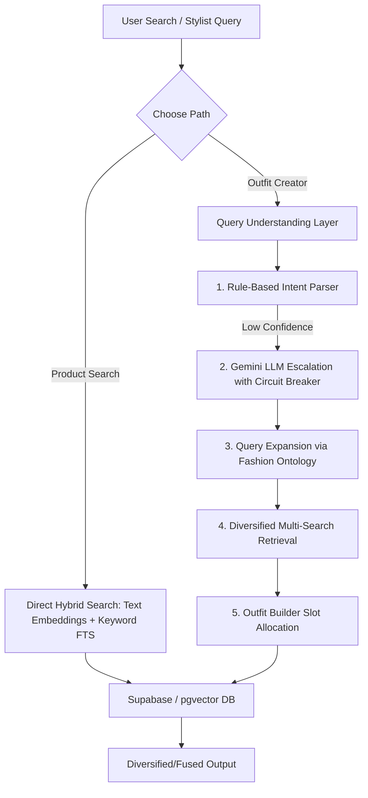

# LuxeAgent — Complete Project Documentation

LuxeAgent is an **AI-powered luxury fashion search and concierge application**. It combines a Next.js frontend web application with hybrid search capabilities (semantic search + keyword search + visual search + custom brand-tier luxury scoring) to deliver two premium experiences: a direct catalog search (**Product Search**) and an AI-driven stylist look builder (**Outfit Creator**).

---

## 1. Problem Statements & Opportunities

Traditional e-commerce search engines struggle with luxury fashion retrieval due to several distinct challenges:
1.  **Vague Stylist Language vs. Rigid Database Queries:** Customers describe outfits in emotional, situational, or vague aesthetic terms (e.g., *"a casual beach wedding look for hot weather"*). Standard search systems fail because they require exact catalog attributes (e.g., *"linen shirts"*).
2.  **Category Domination ("The 12 Sandals" Problem):** Searching for expanded stylist queries (like *"summer beach look"*) often results in a list dominated by a single strong category (e.g., returning 12 pairs of sandals or sunglasses) rather than assembling a balanced look (top, bottom, shoes, accessories).
3.  **Multimodal Gaps:** Consumers often have style reference images but cannot describe them in words. Traditional systems struggle to search images directly or fuse visual similarity with natural-language text constraints.
4.  **Local Experimentation vs. Production Divergence:** Developers building search features need a fast, offline framework to measure retrieval quality (like Recall@K and MRR) before deploying changes to live cloud databases.

---

## 2. Solutions Architecture

LuxeAgent solves these problems by separating execution into two parallel paths sharing a synchronized scoring strategy:



### The Double-Path System
*   **Production Path (Vercel + Supabase):** Serves the Next.js web application. It performs real-time text embeddings via Voyage AI, queries Supabase using a pgvector `hybrid_search` SQL RPC, and ranks products.
*   **Local/Offline Path (Python + FAISS):** Allows offline experimentation. It loads a local Parquet database, builds in-memory FAISS and BM25 indexes, and tests changes using an automated evaluation harness to measure search metrics without database round-trips.

---

## 3. Key Features

*   **Product Search:** A direct search experience with filters (gender, category, brand tier) backed by a unified semantic + keyword SQL execution.
*   **Outfit Creator:** An AI stylist brief analyzer that takes natural descriptions, parses intent, expands the query into sub-categories (Tops, Bottoms, Footwear, Accessories), searches them in parallel, and diversification-filters the results into a unified look.
*   **Multimodal Fusion Search:** Users can upload images or prompt the legacy chatbot. LuxeAgent embeds the image using a CLIP model, queries visual search, and fuses it with text-based keywords to perform multimodal search.
*   **Query Understanding Layer (QUL):** Features fallback mechanisms, rate-limit caching, and fallback regex parsing to ensure the stylist AI never experiences downtime.
*   **Offline Evaluation Harness:** A CLI utility (`evaluation.py`) that scores retrieval quality (Recall@10, Recall@20, MRR) against test query datasets.

---

## 4. Technology Stack

### Frontend & Web Application
*   **Framework:** Next.js 16 (App Router) & React 19.
*   **Language:** TypeScript.
*   **Styling:** Tailwind CSS.
*   **AI Integration:** Vercel AI SDK, Groq (Llama-3.1), Google Gemini.

### Database & Vector Storage
*   **Database:** Supabase.
*   **Vector Engine:** pgvector extension (supporting HNSW index structures and cosine similarity operators).
*   **Text Embedding:** Voyage AI (`voyage-3-lite` — 512-dim).
*   **Image Embedding:** OpenAI CLIP (`ViT-B-32` — 512-dim).

### Offline Processing & Prototyping
*   **Language:** Python 3.11+.
*   **Data Analysis:** pandas, numpy, Jupyter Notebooks.
*   **Vector Indices:** FAISS (Facebook AI Similarity Search).
*   **Keyword Scoring:** rank-bm25.
*   **Web Framework:** FastAPI, Uvicorn (serving local mock endpoints).

---

## 5. Technical Challenges & How We Solved Them

### 💥 Challenge 1: Category Bias in Luxury Scoring
*   **The Issue:** An early implementation applied a custom `category_scores` map (Watches/Handbags = 3, Shirts = 2, Jeans = 1) to prioritize luxury goods. This caused search results to be almost entirely dominated by accessories, making it impossible for the outfit creator to suggest actual clothing items.
*   **The Solution:** We replaced category scoring with a prestige-based **Brand Tier list** (High Tier = 1.0, Mid Tier = 0.6, Entry Tier = 0.3, others = 0.1). We then rebuilt the catalog via `rebuild_catalog.py`, limiting samples per category to ensure a balanced dataset across apparel and footwear.

### 💥 Challenge 2: Vector Dimension Incompatibility
*   **The Issue:** When upgrading from MiniLM (384 dimensions) to Voyage AI (512 dimensions) to improve search relevance, the existing database vectors were incompatible. In pgvector, comparing different dimensional spaces results in runtime query failures.
*   **The Solution:** We wrote SQL migrations (`20260610_voyage_512_text_embedding.sql`) to drop old indices, alter the vector column size to `512`, and null out the incompatible rows. We then immediately executed a data synchronization script to populate the database with correct Voyage embeddings.

### 💥 Challenge 3: PyTorch/CLIP Startup Segfaults
*   **The Issue:** Importing PyTorch and CLIP models globally in Python backend scripts caused segmentation faults on macOS (Metal Performance Shaders/MPS) and delayed startup latency.
*   **The Solution:** We restructured the backend loading sequences to lazily load `open_clip` and `torch` only when CLIP search is explicitly enabled via environment variables (`LUXE_ENABLE_CLIP=1`). In the Next.js API, we implemented a failsafe: if the local CLIP microservice is offline, visual search automatically degrades gracefully to a text-only search rather than throwing a server error.

### 💥 Challenge 4: LLM Quota Limits & Cost Management
*   **The Issue:** Escalating every stylist query to Gemini for semantic intent parsing risked hitting free-tier API rate limits (HTTP 429) and increased user latency.
*   **The Solution:** Created a multi-tier parsing pipeline:
    1.  First, a local regex-based intent parser (`parseQuery`) extracts gender, budget, colors, and direct keywords.
    2.  If confidence is low, it escalates to Gemini using a cached wrapper.
    3.  The LLM call is guarded by an **in-memory LRU cache** and a **circuit breaker**. If the circuit breaker trips (detects 429s), it blocks requests to Gemini for a cooldown duration and automatically redirects the traffic to the local parser.

### 💥 Challenge 5: Results Concentration (The "12 Sandals" Problem)
*   **The Issue:** Expanding stylist queries (e.g., *"beach summer outfit"*) and merging parallel retrievals often flooded results with highly-related footwear (sandals) and accessories (sunglasses), leaving out tops and bottoms.
*   **The Solution:** We implemented a **diversification algorithm** in `retrieval-orchestrator.ts`. It blends search scores with a category penalty:
    $$\text{Final Score} = 0.70 \cdot \text{relevance} + 0.30 \cdot \text{diversity}$$
    Every time an item of a specific category is selected, the algorithm applies a quadratic penalty to the remaining items in that category, forcing the search engine to yield a balanced outfit representation.

---

## 6. Detailed Feature Audit

Here is a checklist of the components and features requested, detailing what is currently implemented in the project and what is missing or only experimental.

| Feature / Goal | Implemented? | Status & Implementation Details |
| :--- | :---: | :--- |
| **Understand Data** | **YES** | **Exploratory Data Analysis & Processing scripts exist:**<br>- `notebooks/01_explore_data.ipynb` for initial data exploration.<br>- `scripts/rebuild_catalog.py` and `scripts/catalog_text.py` load raw CSV metadata (`styles.csv`, `images.csv`) to parse, clean, and verify image assets. |
| **Filter & Keep Useful Categories (Apparel/Footwear)** | **YES** | **Implemented in catalog building:**<br>- `scripts/rebuild_catalog.py` filters `styles.csv` by checking if the `masterCategory` belongs to `["Apparel", "Footwear", "Accessories"]`.<br>- It restricts the final database/parquet to a specific set of 22 target categories (e.g., Shirts, Jeans, Tops, Dresses, Heels, Casual Shoes) to build a clean catalog of products. |
| **Luxury Scoring (e.g. Jeans = 1, Shirts = 2)** | **NO** (Not in Search / Production) | **Existed only in exploratory notebook (`01_explore_data.ipynb`):**<br>- A dictionary mapping article types (e.g., Jeans map to 1, Shirts/Tops map to 2, Watches/Handbags map to 3) was defined in the EDA notebook to compute a category-level score.<br>- **However, this was discarded as a bug/bad practice** because accessory types (Watches/Handbags) with higher scores dominated the search results. It is **NOT** implemented in the active Python backend, Supabase SQL search functions, or the web app. |
| **Text Embeddings** | **YES** | **Fully integrated in production & offline paths:**<br>- Production client/Supabase database migrations switched to **Voyage AI (`voyage-3-lite`, 512 dimensions)** via the API route and Supabase vectors.<br>- Offline Python code historically used MiniLM (`all-MiniLM-L6-v2`, 384 dimensions) for local semantic embedding generation. |
| **Semantic Search** | **YES** | **Fully implemented on both paths:**<br>- **Production:** Built on Supabase `pgvector` with cosine similarity (`<=>` operator) in the SQL `hybrid_search` RPC function.<br>- **Offline:** Implemented using FAISS indexing in local Python (`backend/search.py`). |
| **BM25 (Keyword Scoring)** | **YES** | **Fully integrated in production & offline paths:**<br>- **Offline/Local:** `backend/search.py` builds an in-memory BM25 index on product titles/descriptions to rank keywords.<br>- **Production:** Next.js API layer computes true BM25 scores on candidates fetched from Supabase using precomputed corpus-wide statistics, matching the offline search logic. |
| **Custom Business Luxury Score** | **YES** | **Implemented based on Brand Tiers:**<br>- We compute a custom business luxury score based on brand reputation:<br>  - High Tier (e.g., Gucci, Prada, Dior): **1.0**<br>  - Mid Tier (e.g., Levi's, Ralph Lauren, Diesel): **0.6**<br>  - Entry Tier (e.g., Zara, H&M, Raymond): **0.3**<br>  - Budget / Others: **0.1**<br>- In the local backend, this is weighted into final rankings. In Supabase, the tier is used as a query filter. |
| **CLIP Image Embeddings** | **YES** | **Fully supported multimodally:**<br>- **Generation:** `scripts/generate_clip_embeddings.py` generates 512-dim visual embeddings using `open_clip`'s `ViT-B-32` model.<br>- **Database & RPC:** Stored in the `image_embedding` column in Supabase with an HNSW index. Queries use a custom `visual_search` SQL function.<br>- **API / UI:** An API route (`/api/search/visual`) handles image file inputs, calls a local CLIP embedding microservice, and returns visual/multimodal search results. Used interactively by the legacy Chat view. |

---

## 7. Project Structure & File Guide

### 📂 Directory Tree

```text
luxeagent/
├── frontend/                # Next.js 16 web application (the live product)
│   ├── src/
│   │   ├── app/             # App-router pages + API routes
│   │   │   ├── product-search/   # Product Search experience (page)
│   │   │   ├── outfit-creator/   # Outfit Creator experience (page)
│   │   │   └── api/              # product-search, outfit, search, chat routes
│   │   ├── components/      # React UI components (shell, grid, cards, outfit, chat)
│   │   ├── lib/             # Search primitives + Query Understanding Layer
│   │   └── types/           # Shared TypeScript types (Product, Outfit, generated DB types)
│   └── public/              # Static SVG assets
├── backend/                 # Current Python FastAPI hybrid-search backend
├── app/                     # Older/fuller Python search variant (CLIP-enabled)
├── scripts/                 # Catalog rebuild, embeddings, and Supabase upload utilities
├── supabase/migrations/     # SQL for the products table + hybrid_search function
├── tests/                   # Python unit tests for search/eval logic
├── data/                    # Product catalog, embeddings, and image assets
├── notebooks/               # Exploratory data-analysis notebooks
├── evaluation.py            # Offline retrieval-quality evaluation CLI
├── generate_eval_dataset.py # Builds realistic eval queries from the catalog
└── evaluation_queries.csv   # Generated evaluation dataset
```

---

### 💻 Component Breakdowns

#### `frontend/` — Next.js 16 App Router UI

*   **`src/app/` (Pages & API Handlers):**
    *   `product-search/page.tsx` — Product Search UI view containing the filter toolbar and card layouts.
    *   `outfit-creator/page.tsx` — Main portal to interface with the AI stylist query system.
    *   `api/product-search/route.ts` — Single hybrid-search fetch routine calling Supabase SQL.
    *   `api/outfit/route.ts` — Orchestrator entry-point implementing Query Understanding, diversification, and look grouping.
    *   `api/search/visual/route.ts` — Processes base64 file payloads to invoke visual similarity search.
    *   `api/chat/route.ts` — Streaming LLM (Groq) assistant route utilizing search tools.
*   **`src/components/` (UI Shell & Sub-components):**
    *   `ExperienceShell.tsx` — Contains global styling contexts, branding assets, and route-level headers.
    *   `SearchBar.tsx` — Modular, input-driven filter toolbar matching the target catalog types.
    *   `ProductGrid.tsx` & `ProductCard.tsx` — Responsive presentation layout showing relevance weights and catalog details.
    *   `OutfitResult.tsx` — Visual category container layout mapping item arrays onto Top/Bottom/Shoes slots.
*   **`src/lib/` (Core Search Primitives):**
    *   `hybrid-search.ts` — Shared functions to get Voyage embeddings and issue direct database queries.
    *   `query-parser.ts` — Orchestrates local token match parsing and Gemini LLM fallbacks with circuit breakers.
    *   `fashion-ontology.ts` — Standardized mapping of occasions and seasons to query phrases.
    *   `query-expander.ts` — Expands raw briefs into concrete, searchable targets.
    *   `retrieval-orchestrator.ts` — Multi-search worker running blended ranking and category diversification filters.
    *   `queryExpansion.ts` — Synonym and normalization tokens. Matches python tokenizer exactly.

#### `backend/` — Python FastAPI Service
*   `api.py` — Exposes endpoints like `/search`, `/product/{id}`, and `/catalog/meta` for local exploration.
*   `search.py` — Orchestrates hybrid search pipelines via local FAISS (text and visual) + BM25 indexing.
*   `scoring.py` — Scoring parameters defining text weights (`0.60` semantic, `0.25` BM25, `0.15` luxury).
*   `reranker.py` — Hosts the local CPU-driven MS-Marco Cross-Encoder to refine search results.

#### `scripts/` — Catalog Management
*   `rebuild_catalog.py` — Filters, samples, and balances catalog records. Outputs clean Parquet files.
*   `generate_clip_embeddings.py` — Feeds local catalog photos through OpenCLIP `ViT-B-32` to produce visual embeddings.
*   `upload_to_supabase.py` — Loads data and computed embeddings directly into Supabase tables in batches.

---

## 8. End-to-End Operational Flows

### 🔄 Data Preparation & Indexing Flow
1.  **Extract & Filter:** Raw product metadata is processed from `data/styles.csv`. Records without images or matching the 22 core category profiles are dropped.
2.  **Vector Generation:** 
    *   MiniLM/Voyage embeddings are created based on Natural Language templates generated from brand details and item fields.
    *   CLIP embeddings are calculated using local image binaries.
3.  **Upload:** Parquet details are upserted into Supabase `products`.
4.  **SQL Setup:** SQL migrations prepare HNSW indices and target functions (`hybrid_search`, `visual_search`).

### 🔄 Runtime Request Flow (Live Web App)

```text
[User Prompt] -> [App Router /api/outfit]
                   │
                   ├──> [QUL / query-parser.ts] (Extract slots)
                   │      │
                   │      └──> [Local Regex (Confidence >= 0.7) OR Gemini Fallback]
                   │
                   ├──> [query-expander.ts] (Generate queries per category slot)
                   │
                   ├──> [retrieval-orchestrator.ts] (Issue RPCs, combine & diversify scores)
                   │
                   └──> [outfit-builder.ts] (Structure cards into Top/Bottom/Shoes layout)
```
